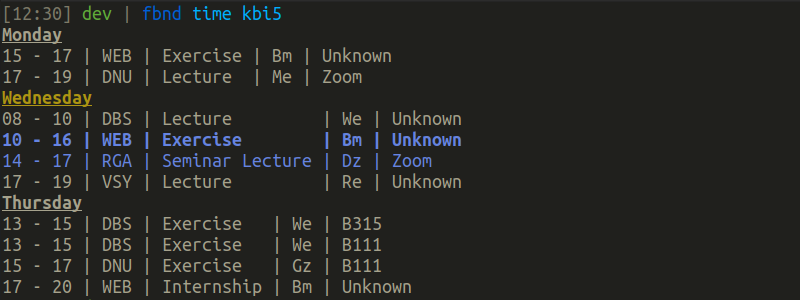

# fbnd

A command line tool to quickly display the timetables for degree programs of the
Faculty of Electrical Engineering and Computer Science, abbreviated FB03, at the
Hochschule Niederrhein.



## How it works

The program uses the [fbnd library](https://github.com/n9v9/fbnd) to fetch and parse the 
available timetables, followed by prettifying and displaying the data.

To list all available degree programs, two `POST` requests are made; one for the
winter and one for the summer semester. To list the timetable for a given degree
program, one `POST` request is made. In both cases less than when manually going
to the page and choosing the correct timetable; and faster as well.

## Features

- List all available degree courses for which timetables are available.

- List timetables for specific degree courses.

- Colored output that highlights important parts.

- Flag to disable colored output to use it in scripts.

- Flag to print all data as JSON.

## Build from source

With Go 1.15 run the following command:

```
go get github.com/n9v9/fbnd/cmd/fbnd
```

## Note

This is **not** an official tool of the Hochschule Niederrhein.

This is only a personal project of mine that I did, because I wanted to view the
timetable in my terminal.
